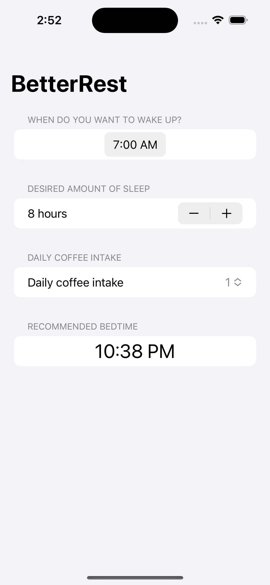

# BetterRest App

BetterRest is an innovative sleep improvement app that uses machine learning to recommend personalized bedtimes. By considering wake-up time, caffeine consumption, and desired sleep duration, the app calculates the optimal time to go to bed, enhancing sleep quality.

## Features

- **Personalized Bedtime:** Input wake-up time, caffeine intake, and desired sleep duration to receive a custom bedtime recommendation.
- **User-Friendly Interface:** Built with SwiftUI for a seamless, intuitive experience across Apple devices.
- **Machine Learning Integration:** Powered by a CreateML model, integrated into the app with CoreML.
- **Easy Setup:** Clone the repo, open in Xcode, and run the app to get started.

## Technologies

- **SwiftUI** Utilized for the user interface.
- **CreateML & CoreML** Utilized for machine learning and integration.

## Getting Started

1. **Clone the Repo:** `git clone https://github.com/roniabusayeed/BetterRest.git`
2. **Open in Xcode:** Launch `BetterRest.xcodeproj` in Xcode.
3. **Build & Run:** Select target device, press "Build and Run" or `Cmd+R`.
4. **Input Info:** Enter wake-up time, caffeine intake, and sleep duration.
5. **Get Bedtime:** Tap "Calculate" to receive your personalized bedtime.

## Contributions & Issues

- Contributions welcome! Fork, clone, create a branch, make changes, and PR.
- Report issues or suggest enhancements through GitHub issues.

## License

*Disclaimer: App recommendations are predictive, not professional medical advice.*
